# Arrakis Engine

[](https://github.com/bleongcw/Arrakis_Engine/actions/workflows/ci.yml)
[](LICENSE)
[](https://www.python.org/)
[](https://github.com/bleongcw/Arrakis_Engine/releases)

A local chess coaching AI that pulls your games from Chess.com and Lichess, runs deep Stockfish analysis on every move, and uses reasoning LLMs to generate personalized, age-appropriate coaching insights — with pattern tracking over time and a live web dashboard.

*Dedicated to my wife Yuying Deng and our three children — Eleanor, Evan, and Estella — whose chess journey inspired every line of this project.*

## Why Arrakis Engine?

My kids play chess. After every game, they'd ask: *"How did I do? What should I practice?"*

Chess engines can tell you *what* went wrong — move 23 was a blunder, you lost 300 centipawns. But they can't tell you *why* it matters, *what* pattern caused it, or *how* to fix it next time. A list of computer evaluations isn't coaching.

Online platforms like Chess.com and Lichess offer basic game review, but nothing that adapts to a child's age, connects lessons across multiple games, or builds on what was taught last week. Real coaching requires context — and context is what's missing.

**Arrakis Engine bridges that gap.** It pairs Stockfish's analytical depth with reasoning LLMs (Claude, GPT, Gemini, and 5 more) to produce coaching that:

- Explains positions in language a 9-year-old can understand
- Remembers what was taught in the last 5 games and builds on it
- Detects game types (tactical battle, comeback, opening disaster) and adjusts advice accordingly
- Tracks patterns over weeks and months — not just single games
- Writes a personal letter to the player after each game with 3 specific things to practice

It supports 8 LLM providers (including Ollama for free local coaching) and runs entirely on your own machine. Your data stays yours.

The name comes from Frank Herbert's *Dune* — on Arrakis, the spice must flow. In chess, good coaching must flow.

## Table of Contents

- [Why Arrakis Engine?](#why-arrakis-engine)
- [Screenshots](#screenshots)
- [How a Chess Parent Uses This](#how-a-chess-parent-uses-this)
- [Quick Start for Chess Parents](#quick-start-for-chess-parents)
- [Architecture](#architecture)
- [Full Installation Guide](#full-installation-guide)
- [CLI Commands](#cli-commands)
- [Typical Workflow](#typical-workflow)
- [How Analysis Works](#how-analysis-works)
- [Web Dashboard](#web-dashboard)
- [Project Structure](#project-structure)
- [Running Tests](#running-tests)
- [Troubleshooting](#troubleshooting)
- [Acknowledgements](#acknowledgements)
- [License](#license)

## Screenshots

### Dashboard — Pipeline Control Panel

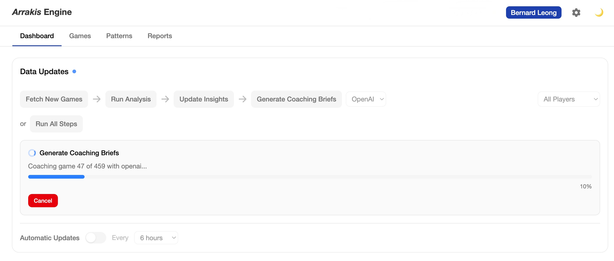

### Games List

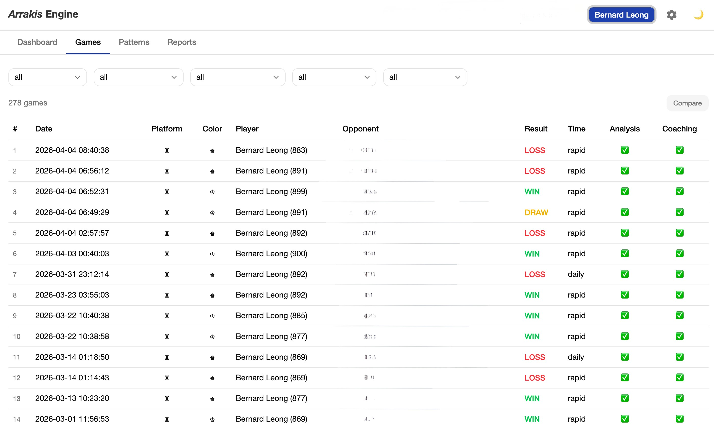

### Patterns — Coaching Summary & Rating Progression

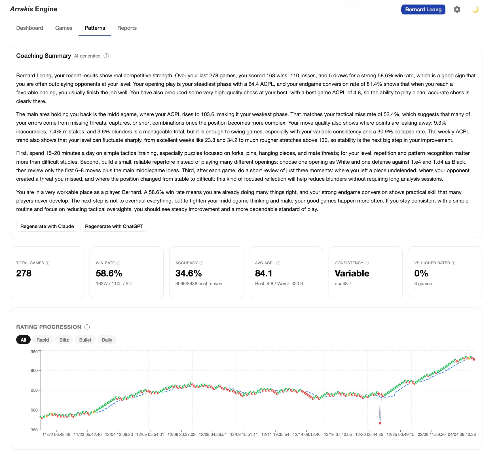

### Patterns — ACPL Trend, Move Quality, Danger Zones & Phase Performance

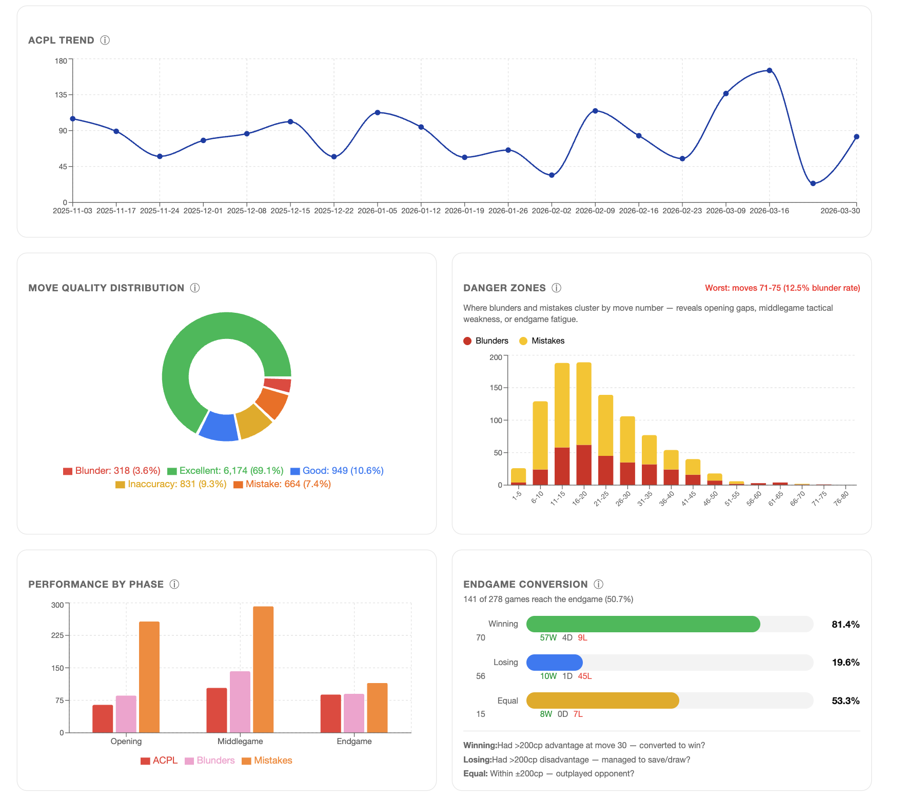

### Patterns — Critical Positions, Tactical Awareness & Resilience

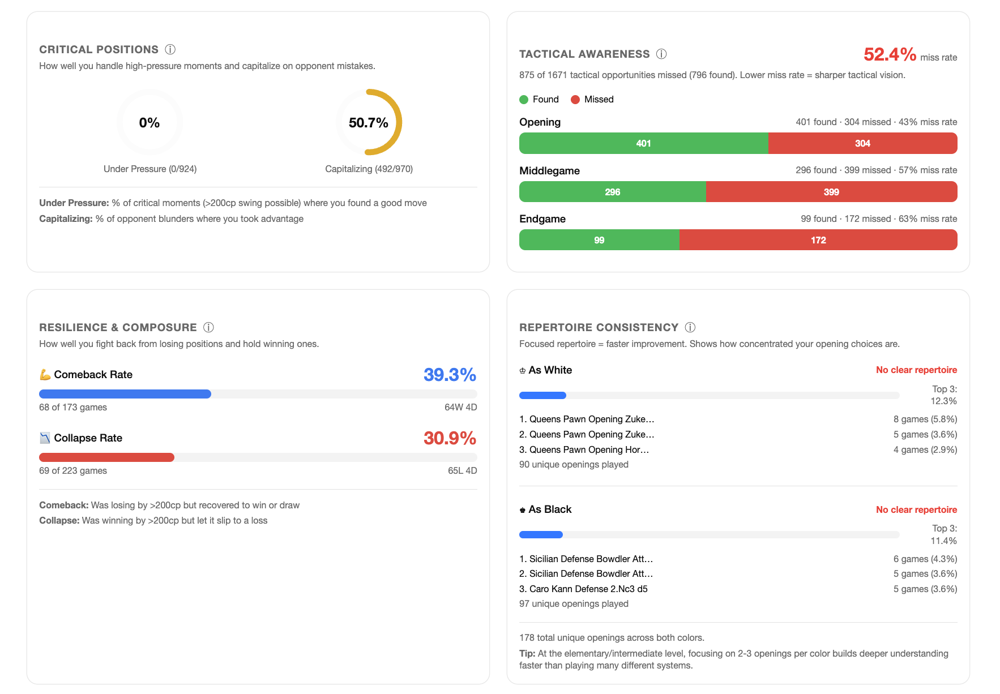

### Patterns — Opening Repertoire

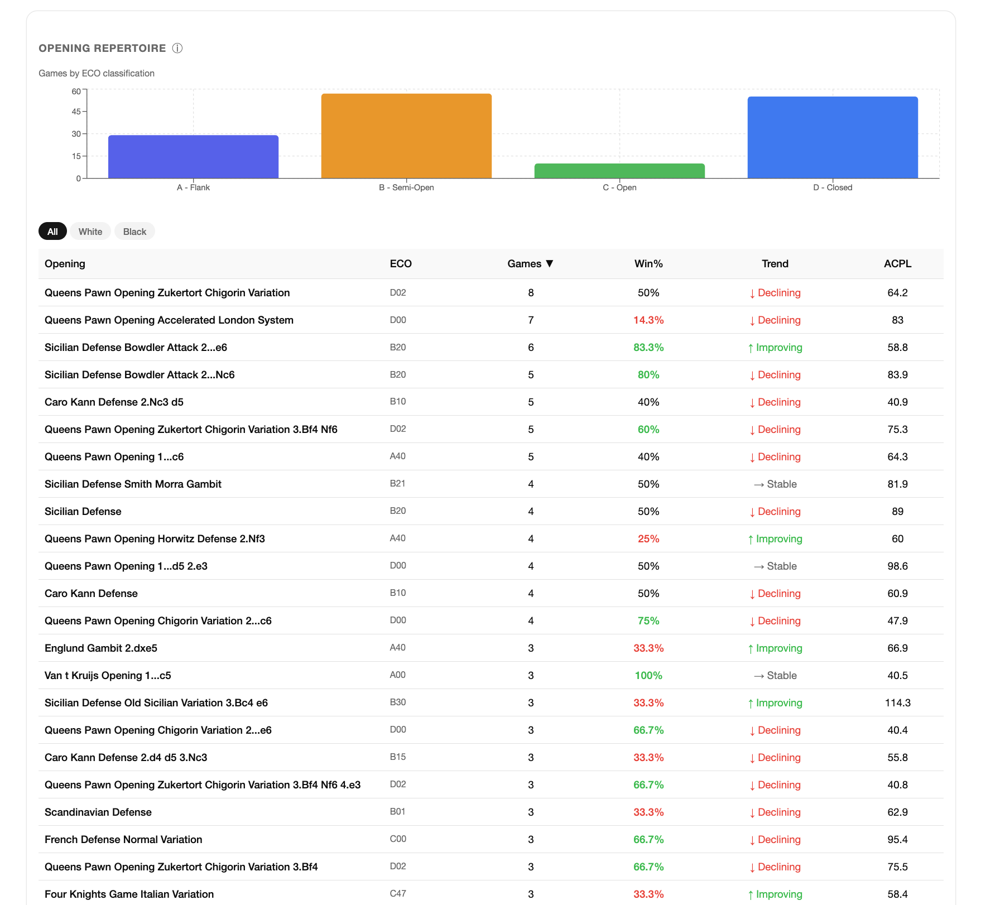

### Patterns — Focus Areas & Time Control Performance

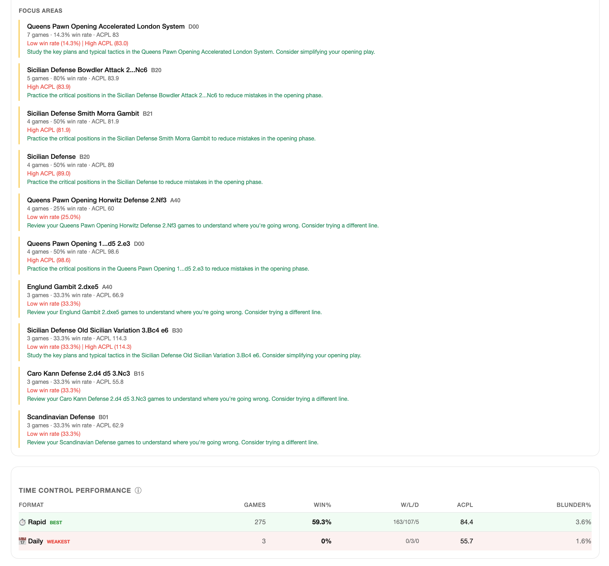

### Patterns — Time Pressure Analysis & Opening Quality

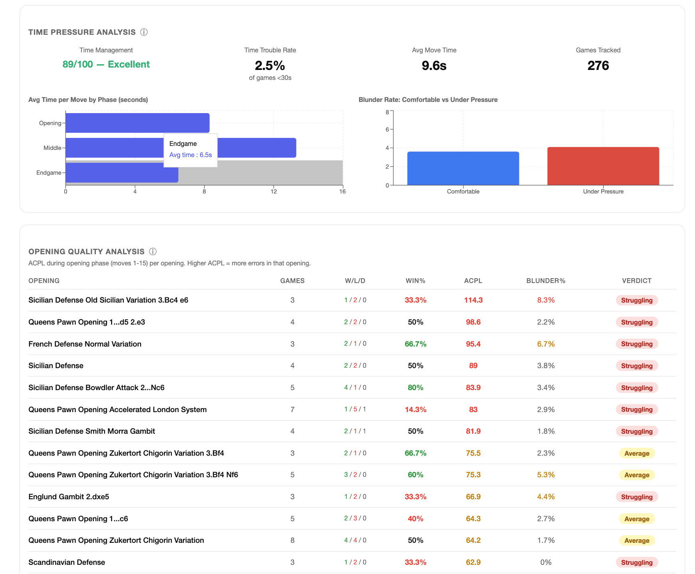

### Patterns — Opening Explorer

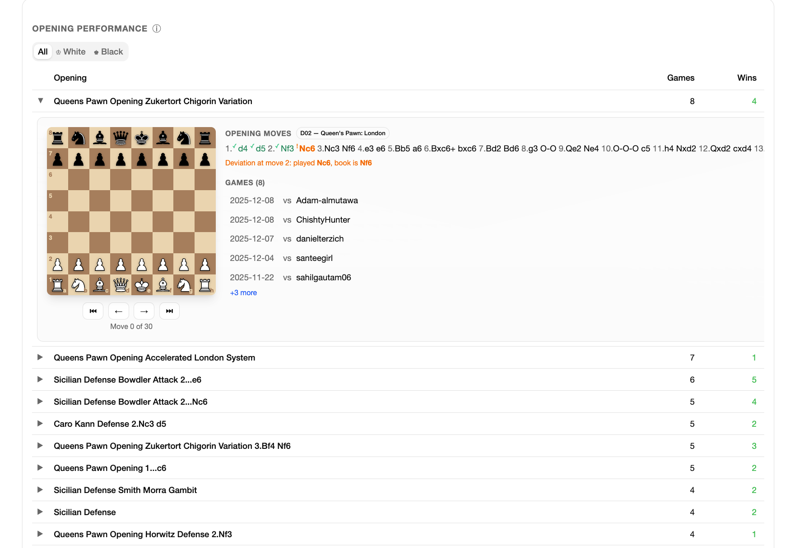

### Reports — Chess Coaching Report

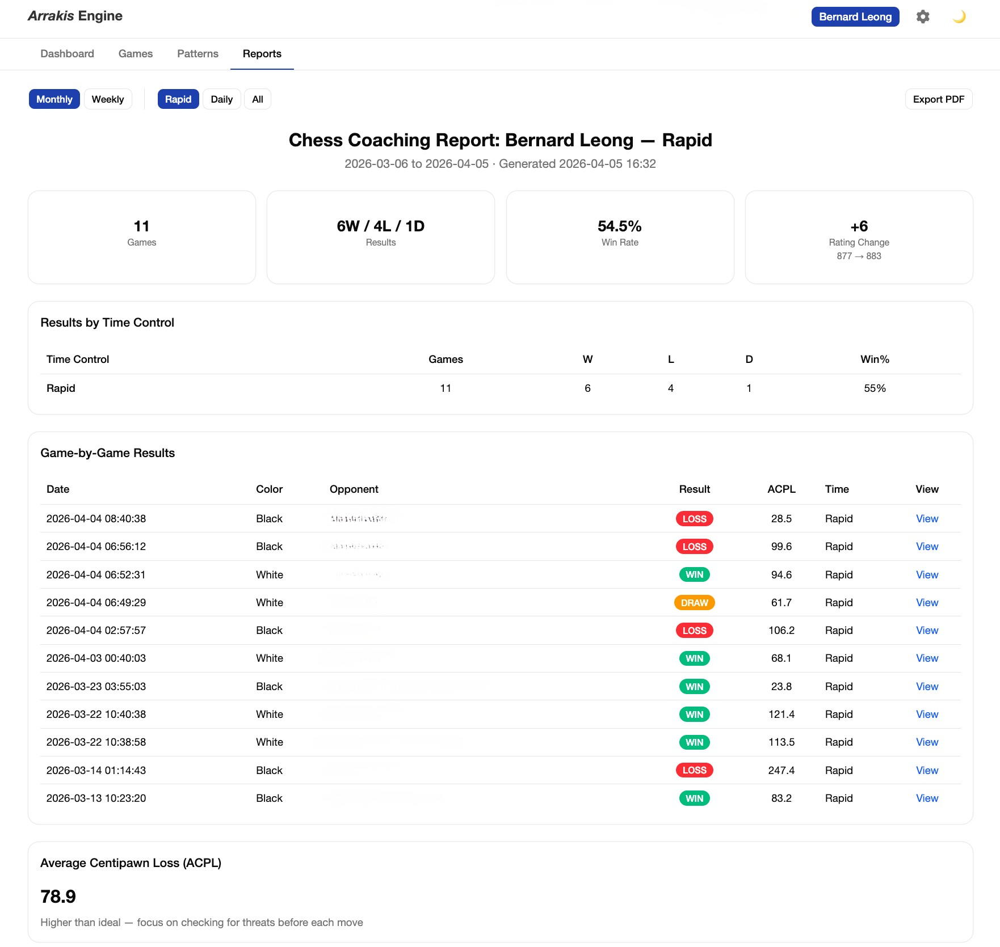

## How a Chess Parent Uses This

You don't need to understand Stockfish, centipawns, or LLMs to use Arrakis Engine. Here's what the experience looks like:

### 1. Pull Your Games

Add your child's Chess.com or Lichess username to the config file. Arrakis fetches every game from the last 6 months automatically — rapid, blitz, bullet, and daily. It deduplicates, so you can run it as often as you like without worrying about double-counting.

### 2. See What Happened

Every game gets deep engine analysis: each move is evaluated, blunders and mistakes are highlighted, and a win-probability chart shows exactly where the game turned. You'll see which moves were excellent, which were inaccurate, and which were outright blunders — color-coded and interactive on the dashboard (see [Games List screenshot](#games-list) above).

### 3. Get Real Coaching

This is where Arrakis is different. An AI reads the full analysis and writes a coaching brief for each game:

- **A game story** — "You played the Italian Game and got a great position out of the opening, but after move 18 you started rushing..."
- **A key lesson** — "When you're winning, slow down and look for your opponent's best reply before moving."
- **A personal letter** — 3 specific, actionable tips written in an encouraging tone appropriate for the player's age.
- **Coach notes** — a technical summary for the parent or coach to use in lesson planning.

The AI remembers what it taught in previous games, so advice builds over time rather than repeating the same tips.

### 4. Track Improvement Over Time

After a few weeks of games, the Patterns page comes alive (see [Patterns screenshots](#patterns--coaching-summary--rating-progression) above). You'll see:

- Whether accuracy and consistency are improving week over week
- Which openings are working and which need attention
- Danger zones — the move ranges where errors cluster
- How well your child converts winning positions in endgames
- Time management patterns — do they blunder more when the clock is low?

**All of this runs locally on your computer. Your data stays yours.**

## Quick Start for Chess Parents

A simplified path to get up and running. You'll need macOS or Linux, Python 3.11+, and Node.js 18+.

```bash
# 1. Clone the repository
git clone git@github.com:bleongcw/Arrakis_Engine.git
cd Arrakis_Engine

# 2. Install Stockfish (the chess engine)
brew install stockfish

# 3. Set up Python
python3 -m venv venv
source venv/bin/activate
pip install -r requirements.txt

# 4. Configure your players
cp config.yaml.example config.yaml
# Edit config.yaml — replace "your_chess_com_username" with your child's username
```

For LLM coaching, create a `.env` file with at least one API key (see [Configure API keys](#4-configure-api-keys)). Or use [Ollama](https://ollama.com) for free local coaching — no API key needed.

```bash
# 5. Run the full pipeline and launch the dashboard
python main.py run-all

# 6. Start the web dashboard (in a new terminal)
cd frontend && pnpm install && pnpm dev
# Open http://localhost:3000
```

For advanced options (compile Stockfish from source, configure multiple providers, Ollama setup), see the [Full Installation Guide](#full-installation-guide) below.

## Architecture

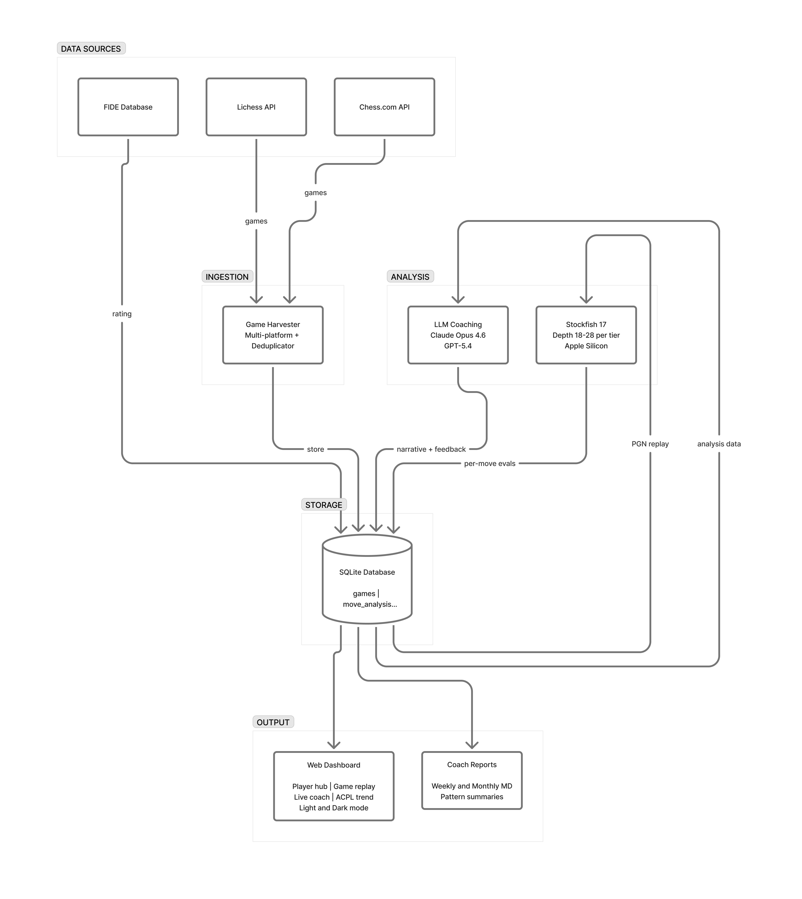

The pipeline is five layers:
1. **Stockfish engine evaluation** — objective, per-move centipawn analysis with clock time extraction
2. **LLM coaching interpretation** — transforms raw engine output into human-readable insights
3. **Pattern aggregation** — tracks trends across games over weeks and months
4. **LLM trend summaries** — interprets cross-game patterns into coaching narratives
5. **Time pressure analysis** — per-move clock data reveals time management patterns and pressure-induced blunders

The frontend is a fully mobile-responsive Next.js 16 + React 19 dashboard with player-scoped URLs (`/<player>/games`, `/<player>/patterns`, `/<player>/reports`).

## Full Installation Guide

> Looking for a faster path? See [Quick Start for Chess Parents](#quick-start-for-chess-parents) above.

### Requirements

| Requirement | Version | Notes |
|---|---|---|
| Python | 3.11+ | Tested on 3.12 |
| Stockfish | 16+ | Apple Silicon recommended |
| macOS / Linux | Any | Developed on macOS (Apple Silicon) |

#### API Keys (for LLM coaching only)

- **Anthropic** — [console.anthropic.com](https://console.anthropic.com) → API Keys
- **OpenAI** — [platform.openai.com](https://platform.openai.com) → API Keys
- **Google** — [aistudio.google.com](https://aistudio.google.com) → API Keys
- **xAI** — [console.x.ai](https://console.x.ai) → API Keys
- **Mistral** — [console.mistral.ai](https://console.mistral.ai) → API Keys
- **DeepSeek** — [platform.deepseek.com](https://platform.deepseek.com) → API Keys
- **Qwen (DashScope)** — [dashscope.aliyun.com](https://dashscope.aliyun.com) → API Keys
- **Ollama** — No API key needed. Install from [ollama.com](https://ollama.com), then `ollama pull deepseek-r1:8b`

The harvester and Stockfish analyzer work without API keys. You only need at least one provider key (or Ollama) for the LLM coaching step.

### 1. Clone the repository

```bash
git clone git@github.com:bleongcw/Arrakis_Engine.git
cd Arrakis_Engine
```

### 2. Install Stockfish

**Option A — Compile from source (recommended, ~2x faster):**

```bash
git clone https://github.com/official-stockfish/Stockfish.git
cd Stockfish/src
make -j profile-build COMP=clang ARCH=apple-silicon
sudo cp stockfish /usr/local/bin/stockfish
cd ../..
rm -rf Stockfish
```

**Option B — Homebrew (simpler):**

```bash
brew install stockfish
```

Verify the installation:

```bash
stockfish <<< "uci" | head -1
# Should print: Stockfish 18 by the Stockfish developers (see AUTHORS file)
```

### 3. Create a virtual environment and install dependencies

```bash
python3 -m venv venv
source venv/bin/activate
pip install -r requirements.txt
```

### 4. Configure API keys

Create a `.env` file in the project root:

```bash
# .env (gitignored — never committed)
ARRAKIS_ANTHROPIC_API_KEY=sk-ant-your-key-here
ARRAKIS_OPENAI_API_KEY=sk-your-key-here
ARRAKIS_GOOGLE_API_KEY=your-google-api-key        # Optional — for Gemini
ARRAKIS_XAI_API_KEY=xai-your-key-here              # Optional — for Grok
ARRAKIS_MISTRAL_API_KEY=your-mistral-key           # Optional — for Mistral
ARRAKIS_DEEPSEEK_API_KEY=sk-your-deepseek-key      # Optional — for DeepSeek
ARRAKIS_QWEN_API_KEY=sk-your-qwen-key              # Optional — for Qwen
# Ollama needs no API key — just `ollama serve` running locally
```

### 5. Set up Ollama (optional — for free local coaching)

If you want to use local models instead of (or alongside) cloud APIs:

```bash
# Install Ollama
brew install ollama

# Pull the default model (~5GB download)
ollama pull deepseek-r1:8b

# Start the Ollama server (keep running in a separate terminal)
ollama serve
```

**Available local models:**

| Model | Pull Command | RAM | Quality |
|-------|-------------|-----|---------|
| DeepSeek-R1 8B | `ollama pull deepseek-r1:8b` | ~5GB | Good for testing |
| DeepSeek-R1 14B | `ollama pull deepseek-r1:14b` | ~9GB | Moderate coaching |
| DeepSeek-R1 32B | `ollama pull deepseek-r1:32b` | ~20GB | Strong coaching |
| Qwen3 8B | `ollama pull qwen3:8b` | ~5GB | Good JSON reliability |

### 6. Create your config.yaml

Copy the example template and fill in your details:

```bash
cp config.yaml.example config.yaml
```

Edit `config.yaml` to match your setup (this file is gitignored — your personal config stays local):

```yaml
players:
  - username: your_chess_com_username       # Chess.com username (required)
    lichess_username: your_lichess_id       # Lichess username (optional)
    fide_id: null                           # FIDE player ID (optional, e.g., 1234567)
    display_name: Player 1
    age: null
    rating: null
  - username: another_chess_com_username
    display_name: Player 2
    age: null
    rating: null

stockfish:
  path: /opt/homebrew/bin/stockfish   # or /usr/local/bin/stockfish
  depth: 22
  threads: 6
  hash_mb: 512

analysis:
  months_lookback: 6

coaching:
  default_provider: claude            # claude | openai | gemini | grok | mistral | deepseek | qwen | ollama
  anthropic_model: claude-opus-4-6
  openai_model: gpt-5.4
  gemini_model: gemini-2.5-pro        # optional — requires ARRAKIS_GOOGLE_API_KEY
  grok_model: grok-3                  # optional — requires ARRAKIS_XAI_API_KEY
  mistral_model: mistral-medium-latest # optional — requires ARRAKIS_MISTRAL_API_KEY
  deepseek_model: deepseek-reasoner   # optional — requires ARRAKIS_DEEPSEEK_API_KEY
  qwen_model: qwen3-235b-a22b        # optional — requires ARRAKIS_QWEN_API_KEY
  ollama_model: deepseek-r1:8b        # optional — requires `ollama serve` running
  ollama_base_url: http://localhost:11434

  # How many recent coached games to inject into each new coaching prompt
  # so the AI avoids repeating prior advice. Default 5, range 1-20.
  # See "Coaching history depth" below for token-cost guidance.
  coaching_history_count: 5

database:
  path: data/chess_coach.db
```

**Stockfish path:** Defaults to `/opt/homebrew/bin/stockfish` (Homebrew). Use `/usr/local/bin/stockfish` if compiled from source. Run `which stockfish` to verify.

**Threads:** Set to your CPU core count minus 2 (e.g., 6 for an 8-core M-series chip) to leave headroom for other processes.

## CLI Commands

| Command | Description |
|---|---|
| `python main.py harvest` | Fetch games from Chess.com and Lichess for all configured players |
| `python main.py analyze` | Run Stockfish analysis on all pending games |
| `python main.py coach` | Generate LLM coaching insights (supports `--limit`, `--provider`, `--history`) |
| `python main.py patterns` | Compute cross-game pattern statistics |
| `python main.py export-json` | Export database to JSON for the web dashboard |
| `python main.py report` | Generate Markdown coaching reports |
| `python main.py dashboard` | Launch the local web dashboard |
| `python main.py fide-update` | Update a player's FIDE rating |
| `python main.py backfill-clocks` | Backfill clock data from PGN annotations for existing games |
| `python main.py run-all` | Run the full pipeline end-to-end |

### Command details

**Harvest games:**

```bash
# All configured players from all platforms
python main.py harvest

# Specific player only
python main.py harvest --player your_chess_com_username

# Filter by platform
python main.py harvest --platform chess.com
python main.py harvest --platform lichess

# Combine filters
python main.py harvest --player your_chess_com_username --platform lichess
```

> **Multi-platform:** Games are fetched from Chess.com (via monthly archives API) and Lichess (via PGN export API). Add `lichess_username` to your player config to enable Lichess harvesting.
>
> **Incremental by design:** The harvester deduplicates by `game_url` — it only fetches new games since your last harvest. Safe to run repeatedly without duplicating data. The dashboard shows which platform each game came from (♜ Chess.com / ♞ Lichess).

**Analyze with Stockfish:**

```bash
# Analyze all pending games (uses settings from config.yaml)
python main.py analyze
```

> Each move has a 10-second time limit to prevent hanging on complex positions. Analysis takes ~5–10 min per game with Homebrew Stockfish or ~3–5 min per game with a source-compiled binary. For large backlogs (400+ games), run overnight.

**Generate coaching insights:**

```bash
# Use default provider from config
python main.py coach

# Use a specific cloud provider
python main.py coach --provider openai
python main.py coach --provider gemini
python main.py coach --provider grok
python main.py coach --provider deepseek

# Use Ollama for free local coaching (requires `ollama serve` running)
python main.py coach --provider ollama --limit 5

# Limit batch size (recommended for rate limits)
python main.py coach --limit 5

# Combine provider and limit
python main.py coach --provider openai --limit 5
```

> **LLM Cost Warning:** Each coaching call sends a detailed prompt (~3,000–7,000 tokens) and receives a structured response (~2,000–4,000 tokens). At current API pricing, coaching a single game costs approximately **$0.03–0.10 with Claude** and **$0.02–0.08 with GPT-5.4**. For a backlog of 400+ games, this can add up to **$15–40 or more**. Start with `--limit 5` to verify quality and estimate your costs before running large batches. **Ollama is free** — it runs locally with no API costs.

> **Rate limits:** Cloud providers have tokens-per-minute caps (e.g., OpenAI's `gpt-5.4` at ~10,000 TPM on free tiers). Use `--limit 5` per batch to avoid 429 errors. Claude typically has higher throughput — `--limit 10-20` is safe. Ollama has no rate limits but is slower (~30–90s per game depending on model size).

> **Dashboard coaching:** You can also coach individual games directly from the dashboard — select any provider from the dropdown on a game's detail page and click **Coach Game**. The pipeline panel also supports all 8 providers with Cloud/Local grouping. Results auto-refresh when complete.

**Update FIDE rating:**

```bash
# Update FIDE rating for a player
python main.py fide-update --player your_username --rating 1600

# Set FIDE ID and rating together
python main.py fide-update --player your_username --fide-id 12345678 --rating 1600
```

> FIDE ratings are updated manually via the CLI. You can also set `fide_id` in `config.yaml` to have it linked on first harvest. The dashboard links directly to the player's FIDE profile at `ratings.fide.com/profile/{fide_id}`.

**Generate reports:**

```bash
# Weekly report for a specific player
python main.py report --player your_chess_com_username --weekly

# Monthly report for all players, custom output directory
python main.py report --monthly --output reports/march
```

**Launch the dashboard:**

```bash
# Terminal 1: Start the Python API backend
python main.py dashboard
# → http://localhost:8000

# Terminal 2: Start the Next.js frontend
cd frontend && pnpm install && pnpm dev
# Open http://localhost:3000
```

**Run the full pipeline:**

```bash
python main.py run-all
# Executes: harvest → analyze → coach → patterns → export-json
```

### Verbose logging

Add `-v` before the subcommand for debug output:

```bash
python main.py -v harvest
python main.py -v analyze
```

## Typical Workflow

### First-time setup

```bash
# 1. Fetch all games from the last 6 months
python main.py harvest

# 2. Run Stockfish analysis (let this run overnight for large backlogs)
python main.py analyze

# 3. Generate coaching insights
python main.py coach

# 4. Compute patterns and export
python main.py patterns
python main.py export-json

# 5. View results
python main.py dashboard
```

### Weekly routine

```bash
# Pull new games, analyze, coach, update patterns, export — all in one command
python main.py run-all

# Generate weekly reports for coaches
python main.py report --player your_chess_com_username --weekly

# Review in dashboard
python main.py dashboard
```

## How Analysis Works

### Stockfish Settings

| Setting | Value | Rationale |
|---|---|---|
| Depth | 22 | Catches all tactical errors at beginner-to-intermediate levels |
| Threads | 6 | Leaves 2 cores free on M-series chips |
| Hash | 512 MB | Sufficient for single-game analysis |
| Time limit | 10s/move | Prevents hanging on complex endgame positions |
| MultiPV | 1 | Best move only (keeps analysis focused) |

### Move Classification

Each move is classified by centipawn loss (how much worse it is than the engine's best move). Thresholds adapt to the player's tier — stricter for advanced players, looser for beginners:

| Classification | Beginner (<800) | Elementary (800–1200) | Intermediate (1200–1600) | Advanced (1600+) |
|---|---|---|---|---|
| Excellent | < 50cp | < 30cp | < 20cp | < 15cp |
| Good | < 100cp | < 50cp | < 40cp | < 30cp |
| Inaccuracy | < 200cp | < 100cp | < 70cp | < 60cp |
| Mistake | < 500cp | < 300cp | < 200cp | < 150cp |
| Blunder | 500+ | 300+ | 200+ | 150+ |

### Evaluation Capping

All engine evaluations are **capped at ±1000 centipawns** before computing centipawn loss, matching the industry standard used by Lichess and Chess.com. This prevents mate scores and extreme positions from distorting ACPL calculations. Mate-in-X scores are mapped to ±1000cp.

### Win Probability

Centipawn evaluations are converted to win probability using the [Lichess formula](https://lichess.org/page/accuracy):

```
win% = 50 + 50 × (2 / (1 + exp(-0.00368208 × cp)) - 1)
```

This makes evaluation swings more intuitive — a drop from 70% to 30% win probability is far more meaningful than "lost 200 centipawns."

### Why Reasoning Models Are Required

ArrakisEngine requires **reasoning LLMs** — models with chain-of-thought capabilities — for its coaching layer. This is a hard requirement, not a preference. Standard chat or instruction-tuned models produce shallow, generic feedback that fails to help players improve.

Chess coaching demands multi-step reasoning at every level:

| Coaching Task | Why Reasoning Is Essential |
|---|---|
| **Tactical analysis** | Must trace forcing sequences ("if Nxe5, then Qd4+ forces Kf1, and Bh3+ wins the queen") — requires look-ahead over multiple moves |
| **Pattern recognition** | Must connect move classifications, eval swings, and game phases into a coherent strategic narrative rather than listing isolated facts |
| **Coaching history** | Must read the last 5 games' coaching and deliberately vary advice, build on prior lessons, and track whether the player is improving at specific skills |
| **Age-appropriate explanations** | Must simplify complex positional concepts for a 7-year-old differently than for a 14-year-old, while keeping the analysis accurate |
| **Game type detection** | Must classify games into types (tactical battle, comeback, positional grind, opening disaster, etc.) and adjust coaching emphasis accordingly |
| **Structured JSON output** | Must produce reliable, parseable JSON with all required fields — reasoning models are significantly more consistent at this than non-reasoning models |

**Supported reasoning models (8 providers):**

| Provider | Model | API Identifier | Notes |
|---|---|---|---|
| Anthropic | Claude Opus 4.6 | `claude-opus-4-6` | Extended thinking, excellent coaching tone |
| OpenAI | GPT-5.4 | `gpt-5.4` | Strong reasoning via Responses API |
| Google | Gemini 2.5 Pro | `gemini-2.5-pro` | Long context, strong reasoning |
| xAI | Grok 3 | `grok-3` | OpenAI-compatible API |
| Mistral | Mistral Medium | `mistral-medium-latest` | European alternative |
| DeepSeek | DeepSeek-R1 | `deepseek-reasoner` | Strong reasoning, affordable |
| Alibaba | Qwen3 235B | `qwen3-235b-a22b` | Large reasoning model |
| Ollama (Local) | DeepSeek-R1 8B | `deepseek-r1:8b` | Free, runs locally, no API key |

See [ROADMAP.md](ROADMAP.md) for details on local model quality considerations.

> **Non-reasoning models will not work.** Models without chain-of-thought (e.g., GPT-4o-mini, small instruction-tuned models, base models) miss tactical sequences, generate generic advice not grounded in actual positions, and produce inconsistent JSON. If you swap in a non-reasoning model, expect significantly degraded coaching quality.

### LLM Coaching Output

For each analyzed game, the LLM produces:

| Output | Audience | Description |
|---|---|---|
| **Game narrative** | Child | 2–3 paragraph story of what happened, encouraging tone |
| **Key lesson** | Child | Single most important takeaway |
| **Practical focus** | Child | One specific thing to practice |
| **Opening analysis** | Both | Opening name, quality rating, counter-move assessment, and tip |
| **Critical moments** | Both | 3–5 positions with what happened vs. what was better |
| **Player feedback** | Child | Personal letter with 3 actionable tips, growth mindset framing |
| **Coach notes** | Coach | Technical summary for lesson planning |

### Coaching History Depth

To prevent the AI coach from giving the same advice every game, Arrakis injects a "coaching history" block into every prompt — the **last N coached games' lessons, practical focuses, and narrative openings**. The coach is then instructed to build on that history rather than repeat it.

The depth is configurable via the `coaching_history_count` setting (in `config.yaml`, the Settings page, or `--history N` on the CLI). Default is **5**; range is **1–20**.

**Token cost — each history game adds ~500 prompt tokens.** Pick the depth that fits your provider's context window:

| Depth | Extra prompt tokens | Recommended for |
|---|---|---|
| **5** (default) | ~2,500 | All providers, including Ollama 8B local — safe baseline |
| 10 | ~5,000 | All cloud providers; tight on Ollama 8B (may overflow) |
| 15 | ~7,500 | Cloud providers only |
| 20 (max) | ~10,000 | Large-context cloud providers only — Claude, Gemini |

**When to increase it.** If a player has 50+ coached games and you find the coach repeating itself or missing recurring issues that span more than 5 games, raise the depth to 10. If you're running a deep retrospective (end of month, end of season), 15–20 gives the AI enough context to surface long-arc patterns.

**Local model warning.** Ollama with `deepseek-r1:8b` has a smaller context window. Settings above 10 may cause prompt truncation or degraded coaching quality. Use 5 for local Ollama, 10–20 for Claude / Gemini / GPT-5.

### Pattern Tracking

Patterns are aggregated across all games per player:

**Core Metrics:**
- **Opening performance** — win rate by opening name, split by color (All / White / Black)
- **ACPL trend** — per-game ACPL (±1000cp capped) averaged in weekly buckets with game data points
- **Phase analysis** — error frequency and ACPL in opening (moves 1–15), middlegame (16–30), endgame (31+)
- **Rating performance** — win rate vs. higher/lower/equal rated opponents
- **Move quality distribution** — percentage of excellent/good/inaccuracy/mistake/blunder moves

**Advanced Metrics (Phase 1):**
- **Accuracy %** — percentage of moves matching the engine's best move (higher = more precise play)
- **Consistency Score** — standard deviation of per-game ACPL; rated as Very consistent / Consistent / Variable / Highly variable; includes best and worst game ACPL
- **Danger Zones** — histogram of blunders and mistakes by move number range (5-move buckets), highlighting the move range with the highest error rate; reveals opening gaps, middlegame tactical weakness, or endgame fatigue
- **Endgame Conversion** — tracks how well the player converts advantages: winning endgames (>200cp at move 30) converted to wins, losing endgames saved/drawn, equal endgames outplayed; includes endgame reach percentage
- **Time Control Performance** — win rate, ACPL, and blunder rate per time format (bullet/blitz/rapid/daily); highlights best and weakest formats

**Deeper Insights (Phase 2):**
- **Critical Position Success Rate** — how often the player finds good moves in high-stakes moments (>200cp swing possible); also tracks capitalizing on opponent blunders with SVG gauge charts
- **Comeback & Collapse Rate** — comeback: was losing by >200cp but recovered to win/draw; collapse: was winning by >200cp but let it slip; measures mental resilience and composure
- **Opening Quality Analysis** — ACPL during opening phase (moves 1-15) per opening name; rates each as "Strong — keep playing", "Solid", "Average", or "Struggling"; sorted by worst ACPL to highlight areas needing improvement
- **Tactical Miss Rate** — positions where a tactic existed (>200cp advantage available) but the player missed it; broken down by game phase (opening/middlegame/endgame) with stacked bar chart
- **Repertoire Consistency** — measures how focused the player's opening choices are, split by color; tracks unique openings, top-3 concentration %, and rates as Very focused / Reasonably consistent / Scattered / No clear repertoire

**Time Pressure Analysis:**
- **Time Trouble Rate** — percentage of games where the player's clock dropped below 30 seconds
- **Average Time per Move by Phase** — how long the player spends per move in opening, middlegame, and endgame
- **Blunder Rate Under Pressure** — comparison of blunder frequency when clock is below 60s vs above 60s
- **Time Management Score** — composite 0–100 score based on time trouble frequency and pressure-induced blunder rate

## Web Dashboard

Built with Next.js 16, React 19, shadcn/ui, Tailwind CSS, and Recharts. Fully mobile-responsive (320px+). Requires Node.js 18+.

```bash
# Terminal 1: Start the Python API backend
python main.py dashboard

# Terminal 2: Start the Next.js frontend
cd frontend && pnpm install && pnpm dev
# Open http://localhost:3000
```

**Player-scoped URLs:** All player pages use bookmarkable URLs like `/<username>/games`, `/<username>/patterns`, etc. Switching players in the header navigates to the same section under the new player's URL.

### Player Hub & Navigation

- **Player-scoped URLs** — every player page is bookmarkable and shareable: `/<username>/games`, `/<username>/patterns`, `/<username>/reports`
- **Multi-player switching** — player selector in the header; switching players navigates to the same section under the new player's URL
- **Player Hub** — default landing page with Chess.com, Lichess, and FIDE profiles, tier badge, game counts, and direct links to external profiles

### Games & Analysis

- **Games list** — filterable by result, time control, coaching status, month, platform (Chess.com / Lichess), and date range
- **Platform icons** — ♜ Chess.com / ♞ Lichess shown per game
- **Game analysis** — interactive chessboard, move-by-move eval chart (bars colored by move classification), color-coded move list for both player and opponent
- **Move quality summary** — per-game table with proportional bars for excellent/good/inaccuracy/mistake/blunder
- **Opening analysis** — LLM-generated assessment with opening name, quality rating, counter-move correctness, and tips
- **On-demand coaching** — provider dropdown (8 providers: Claude, ChatGPT, Gemini, Grok, Mistral, DeepSeek, Qwen, Ollama) with Coach Game button on each game, auto-refresh on completion
- **Feedback to Player** — personal letter with 3 actionable tips and growth mindset framing
- **Game Comparison View** — select two games and compare side-by-side with independent chessboards, eval charts, move quality summaries, and a comparison table highlighting differences in ACPL, excellent moves, blunders, and more

### Patterns & Insights

- **LLM Trend Summary** — AI-generated coaching narrative interpreting cross-game patterns (provider dropdown with all 8 providers, regenerate option)
- Overview stat cards (games, win rate, accuracy %, ACPL, consistency, vs higher-rated)
- ACPL Trend chart with clickable info modal
- Move Quality Distribution donut with percentages
- Danger Zones histogram (blunders/mistakes by move range)
- Phase Performance bar chart (opening/middlegame/endgame)
- Endgame Conversion rates (winning/losing/equal positions)
- Critical Position gauges (under pressure + capitalizing on opponent mistakes)
- Tactical Awareness bars (found vs missed by phase)
- Resilience & Composure (comeback rate + collapse rate)
- Repertoire Consistency (white/black focus scores with top-3 openings)
- Time Control Performance table (win%, ACPL, blunder% per format)
- Opening Quality Analysis table (ACPL per opening with verdict badges)
- Time Pressure Analysis: time management score, time trouble rate, avg time per move by phase (bar chart), blunder rate comparison under pressure vs comfortable
- **Rating Progression Chart** — interactive line chart showing rating over time with result-colored dots (green win / red loss / amber draw), time class filter (all/rapid/blitz/bullet/daily), 10-game moving average trend line, and info modal
- **Opening Repertoire Tracker** — ECO distribution bar chart, sortable opening table with win rate and trend indicators (improving/declining/stable), All/White/Black filter tabs, and focus areas panel highlighting openings that need work
- Opening Win Rate table (split by All / White / Black) with **interactive Opening Explorer** — click any opening to expand a chessboard showing the opening position with step-through move controls, plus a linked list of all games using that opening; board orientation flips on the Black tab
- **Opening Book Integration** — ECO code and opening name badge, moves annotated with green checkmarks (matches book theory) and orange markers (deviations), with "Book move: X" vs "Player played: Y" callouts; expanded to 438 ECO entries (A00-E99) with deeper variations
- Info modals (ⓘ) with educational explanations for every pattern component

### Reports

- **Monthly/weekly coaching reports** for coaches
- Time class filter tabs: **Rapid** (default), **Daily**, **All** — stats recompute per filter
- Summary cards: games, W/L/D, win rate, rating change
- Results by time control table
- Game-by-game results with clickable links to game detail pages, sorted most-recent-first, color-coded result badges (green win / red loss / amber draw)
- ACPL analysis with interpretation
- Move quality distribution
- Game phase analysis (opening/middlegame/endgame) with worst-phase highlighting
- Top improvement areas (auto-generated from blunder/mistake counts and phase weaknesses)
- Critical positions to review with game links (from LLM coaching data)
- Coaching recommendations (aggregated from individual game coaching)
- **PDF export** via `window.print()` with print-optimized CSS

### Pipeline Control

- **Data Updates panel** — one-click buttons on the dashboard to run the pipeline without CLI:
  - **Fetch New Games** → **Run Analysis** → **Update Insights** shown as a visual flow with arrows
  - **Run All Steps** option to chain all four (harvest → analyze → patterns → coach) in one click
  - Provider selector for coaching step (all 8 providers with Cloud/Local grouping)
  - Player selector to run for a specific player or all players
  - Real-time progress bar, step indicators, and friendly result summaries
  - Tooltips explaining what each step does

### Accessibility & Theming

- **Mobile responsive** — all pages adapt to mobile (320px+), tablet, and desktop; ChessBoard auto-sizes via ResizeObserver; tables progressively hide low-priority columns; nav bar scrolls horizontally; player selector shows first names on mobile
- **Light/dark mode** — toggle with theme button, persists across sessions
- **Error boundaries** — root error boundary, player-scoped error boundary, custom 404 page
- **Aria-labels** on player selector buttons and game table rows
- **Live data** — reads from SQLite directly, updates in real-time

## Project Structure

```
Arrakis_Engine/
├── CLAUDE.md              # Project context for Claude Code
├── README.md              # This file
├── config.yaml.example    # Template config (copy to config.yaml)
├── config.yaml            # Your personal config (gitignored)
├── requirements.txt       # Python dependencies
├── .env                   # API keys (gitignored)
├── .gitignore
├── pyproject.toml         # pytest marker config (integration/live)
├── main.py                # CLI entry point — all commands
├── src/
│   ├── models.py          # SQLite schema (5 tables) and data helpers
│   ├── harvester.py       # Multi-platform game fetcher (Chess.com + Lichess)
│   ├── analyzer.py        # Stockfish move-by-move analysis engine + clock extraction
│   ├── coach.py           # LLM coaching layer (8 providers via llm_providers.py)
│   ├── llm_providers.py   # Unified LLM provider abstraction (Claude, OpenAI, Gemini, Grok, Mistral, DeepSeek, Qwen, Ollama)
│   ├── tiers.py           # Adaptive tier system (Beginner → Expert)
│   ├── patterns.py        # Cross-game pattern detection + LLM trend summaries
│   ├── export.py          # JSON export for dashboard
│   ├── dashboard_server.py # REST API server (GET + POST endpoints)
│   ├── pipeline_state.py  # In-memory pipeline task state (thread-safe)
│   ├── scheduler.py       # Automated pipeline scheduler (harvest → analyze → patterns → coach)
│   └── report.py          # Report generator (structured JSON + markdown export)
├── frontend/              # Next.js 16 + React 19 + shadcn/ui dashboard
│   ├── app/
│   │   ├── layout.tsx         # Root layout (providers, header, nav)
│   │   ├── page.tsx           # Home → redirect to /dashboard
│   │   ├── providers.tsx      # ThemeProvider, PlayerProvider (syncs from URL)
│   │   ├── globals.css        # Global styles + print CSS for PDF export
│   │   ├── error.tsx          # Root error boundary
│   │   ├── not-found.tsx      # Custom 404 page
│   │   ├── dashboard/page.tsx # All-players overview
│   │   └── [player]/          # Player-scoped dynamic routes
│   │       ├── error.tsx              # Player-scoped error boundary
│   │       ├── games/page.tsx         # Games list with filters + compare mode
│   │       ├── games/[id]/page.tsx    # Game detail: board, eval, coaching
│   │       ├── games/compare/page.tsx # Side-by-side game comparison
│   │       ├── patterns/page.tsx      # Pattern analytics + AI trend summary
│   │       └── reports/page.tsx       # Coaching reports (Rapid/Daily/All + PDF)
│   ├── components/
│   │   ├── app-header.tsx     # Title bar + player selector
│   │   ├── nav-bar.tsx        # Navigation (player-scoped links)
│   │   ├── player-selector.tsx# Player switching (navigates URLs)
│   │   ├── player-card.tsx    # Player profile card for dashboard
│   │   ├── report-view.tsx    # Report renderer (time class filter + game links)
│   │   ├── games-table.tsx    # Clickable game rows
│   │   ├── games-filters.tsx  # Result, time, coaching, month, platform filters
│   │   ├── tier-badge.tsx     # Color-coded tier display
│   │   ├── theme-toggle.tsx   # Dark/light mode toggle
│   │   ├── pipeline-control-panel.tsx # Data Updates panel (harvest/analyze/patterns/coach)
│   │   ├── game-detail/       # ChessBoard, EvalChart, MoveList, CoachingPanels, ComparisonSummary
│   │   ├── patterns/          # 14 visualization components + TrendSummary + TimePressure + OpeningExplorer + RatingProgression + OpeningRepertoire
│   │   └── ui/                # shadcn/ui primitives (card, table, button, etc.)
│   ├── hooks/                 # useChessNavigation, usePipeline, useCoaching
│   └── lib/                   # API client (api.ts), types (types.ts), providers (providers.ts), utils
├── docs/
│   └── screenshots/       # Architecture diagram and screenshots
├── tests/                 # Test suite (246 tests across 3 tiers)
│   ├── conftest.py        # Shared fixtures (db, player, stockfish, llm)
│   ├── test_models.py
│   ├── test_harvester.py
│   ├── test_analyzer.py
│   ├── test_coach.py
│   ├── test_patterns.py
│   ├── test_tiers.py
│   ├── test_export.py
│   ├── test_report.py
│   ├── test_dashboard_server.py
│   ├── test_llm_providers.py         # Provider registry, model resolution, dispatch
│   ├── test_scheduler.py             # 4-step pipeline, cancel, provider passthrough
│   ├── test_analyzer_integration.py  # Stockfish integration (pytest -m integration)
│   ├── test_coach_live.py            # LLM API live tests (pytest -m live)
│   └── test_pipeline_e2e.py          # Full pipeline E2E (requires both)
├── data/
│   └── chess_coach.db     # SQLite database (auto-created, gitignored)
└── reports/               # Generated coach reports (gitignored)
```

### Database Schema

| Table | Purpose |
|---|---|
| `players` | Player profiles (username, display name, age, rating, FIDE ID/rating) |
| `games` | Game records with PGN, ratings, result, platform, ACPL, analysis/coaching status |
| `move_analysis` | Per-move Stockfish evaluation (capped centipawn, win prob, classification, clock_seconds) |
| `game_coaching` | LLM-generated coaching output per game (narrative, feedback, opening analysis) |
| `player_patterns` | Aggregated pattern statistics per player per period |

## Running Tests

246 tests across 15 files, organized into three tiers using pytest markers. Integration and live tests are excluded by default — opt in explicitly.

### Commands

```bash
# Unit tests only (default — fast, no external dependencies)
python -m pytest tests/ -v
# → 227 tests in ~14s, all mocked

# Stockfish integration tests (requires Stockfish binary)
python -m pytest tests/ -m integration -v
# → 7 tests: real Stockfish analysis on Scholar's Mate (~25s)

# LLM API live tests (requires ARRAKIS_ANTHROPIC_API_KEY or ARRAKIS_OPENAI_API_KEY)
python -m pytest tests/ -m live -v
# → 5 tests: real coaching API calls (~3min, ~$0.05 per run)

# Full pipeline E2E (requires both Stockfish + API key)
python -m pytest tests/ -m "integration and live" -v
# → 1 test: analyze → coach end-to-end (~1min)

# Everything
python -m pytest tests/ -m "" -v
# → All 246 tests (~5min)
```

### Test Coverage by Module

**Unit tests** (227 tests — all mocked, no external dependencies):

| File | Tests | Coverage |
|------|-------|---------|
| `test_models.py` | 16 | Schema init, player upsert, constraints, PGN opponent extraction, DB path creation, migrations |
| `test_harvester.py` | 20 | Chess.com + Lichess parsing: player side, result, time control, date, game URL, deduplication, platform filtering |
| `test_analyzer.py` | 19 | Win probability formula, move classification boundaries, eval capping (±1000cp), PovScore→centipawn conversion |
| `test_coach.py` | 18 | Move formatting, smart truncation (short vs 80+ move games), critical moments, JSON parsing, Claude/OpenAI provider switching, batch limit, DB status transitions |
| `test_patterns.py` | 38 | Game phase classification, results aggregation, rating performance, accuracy, consistency, danger zones, endgame conversion, comeback/collapse detection, opening ACPL, tactical misses, repertoire consistency, opening name extraction |
| `test_tiers.py` | 21 | Rating→tier boundary mapping (Beginner→Expert), tier-specific move thresholds, config validation |
| `test_report.py` | 9 | Report generation (weekly/monthly), ACPL interpretation thresholds, time control tables, missing data handling |
| `test_dashboard_server.py` | 14 | HTTP endpoints (players/games/status/patterns), filtering (result, time class, date range, player), CORS headers, 404 |
| `test_export.py` | 7 | JSON export, PGN preview truncation, coaching data, missing analysis, patterns |
| `test_llm_providers.py` | 52 | Provider registry validation (8 providers), thinking tag stripping, model resolution (explicit/config/default), provider dispatch (Anthropic/OpenAI/Google/Mistral/Ollama), API key detection, availability listing |
| `test_scheduler.py` | 6 | 4-step pipeline execution (harvest→analyze→patterns→coach), player filter passthrough, cancel event propagation, provider passthrough, progress update verification (1/4–4/4), Stockfish validation |

**Stockfish integration tests** (7 tests — requires Stockfish binary):

| File | Tests | Coverage |
|------|-------|---------|
| `test_analyzer_integration.py` | 7 | End-to-end Stockfish analysis on Scholar's Mate: move row creation, eval sanity checks (opening ~0cp, mate→±1000cp), ACPL storage, move classifications, batch processing, stuck game recovery, empty PGN handling |

The `stockfish_path` fixture auto-resolves from `config.yaml` → `STOCKFISH_PATH` env var → `which stockfish`. Tests skip with a clear message if Stockfish is not found.

**LLM API live tests** (5 tests — requires API key, ~$0.05/run):

| File | Tests | Coverage |
|------|-------|---------|
| `test_coach_live.py` | 5 | Real LLM coaching: valid JSON response, all required keys present (narrative, key_lesson, practical_focus, critical_moments, coach_notes), DB storage with provider:model format, error handling |

The `llm_provider` fixture checks for `ARRAKIS_ANTHROPIC_API_KEY` first, falls back to `ARRAKIS_OPENAI_API_KEY`. Tests skip if neither is set.

**Full pipeline E2E** (1 test — requires both Stockfish + API key):

| File | Tests | Coverage |
|------|-------|---------|
| `test_pipeline_e2e.py` | 1 | Insert game → Stockfish analysis → LLM coaching → verify complete status, move rows, and valid coaching JSON |

## Troubleshooting

**"unable to open database file"**
The `data/` directory is created automatically. If you see this error, check that you're running commands from the project root directory.

**"No such file or directory: '/usr/local/bin/stockfish'"**
Update the `stockfish.path` in `config.yaml` to match your installation. Use `which stockfish` to find the correct path.

**"ARRAKIS_ANTHROPIC_API_KEY not set" (or any provider key)**
Create a `.env` file in the project root with your API keys (see [Configure API keys](#4-configure-api-keys)). You only need keys for the providers you use. Ollama requires no API key.

**"Cannot connect to Ollama"**
Ollama must be running before you start coaching. Start it with `ollama serve` in a separate terminal. If using a non-default URL, update `ollama_base_url` in `config.yaml`.

**Ollama coaching is slow**
Local models are slower than cloud APIs. The 8B model (~30 tok/s on M3 Max) takes ~30–60s per game. For faster results, use a cloud provider. For better local quality, try a larger model: `ollama pull deepseek-r1:14b` or `deepseek-r1:32b` (requires more RAM).

**Analysis is very slow**
Homebrew Stockfish runs at ~4.4M nodes/sec vs ~9–14M nodes/sec for a source-compiled binary. Consider compiling from source (see [Install Stockfish](#2-install-stockfish)). Each move has a 10-second time limit to prevent hanging. You can also reduce depth in `config.yaml` — depth 18 is ~3x faster with minimal loss in accuracy for beginner-to-intermediate players.

**OpenAI 429 rate limit errors**
Your API tier has a tokens-per-minute cap (e.g. 10,000 TPM on free tier). Use `--limit 5` to batch and allow the 10-second delay between calls. Upgrading your OpenAI plan raises the limit. Alternatively, use `--provider claude`.

**Games show "error" analysis or coaching status**
Reset errored games and re-run:
```bash
# Reset analysis errors
python3 -c "
from src.models import init_db
conn = init_db('data/chess_coach.db')
conn.execute(\"UPDATE games SET analysis_status = 'pending' WHERE analysis_status = 'error'\")
conn.commit()
print('Reset', conn.total_changes, 'games')
conn.close()
"
python main.py analyze

# Reset coaching errors
python3 -c "
from src.models import init_db
conn = init_db('data/chess_coach.db')
conn.execute(\"UPDATE games SET coaching_status = 'pending' WHERE coaching_status = 'error'\")
conn.commit()
print('Reset', conn.total_changes, 'games')
conn.close()
"
python main.py coach --limit 5
```

**"database is locked"**
SQLite only allows one writer at a time. Stop the analyzer before running harvest or coach in another terminal. The dashboard (read-only) can run concurrently without issues.

## Acknowledgements

This project wouldn't exist without the generous work of others:

- **Chess coaches and parents** who tested early versions, stress-tested the pipeline with real game data, and gave invaluable feedback on what makes coaching advice actually useful for young players.
- **The Stockfish team** — the open-source chess engine that powers all analysis in this project. Decades of engineering distilled into a single binary.
- **python-chess** by Niklas Fiekas — the library that makes PGN parsing and board manipulation effortless in Python.
- **Lichess** — for the opening book data (438 ECO entries) and the win probability formula that the entire chess community relies on.
- **Next.js, shadcn/ui, and Recharts** — the frontend stack that made the dashboard possible.
- **The reasoning model ecosystem** — Anthropic, OpenAI, Google, xAI, Mistral, DeepSeek, Alibaba (Qwen), and the Ollama project — for building the AI models that turn raw analysis into real coaching.

## License

ArrakisEngine is licensed under the [GNU Affero General Public License v3.0](LICENSE) (AGPL-3.0).

You are free to use, modify, and distribute this software under the terms of the AGPL-3.0. If you modify ArrakisEngine and provide it as a service over a network, you must make your modified source code available under the same license.

For commercial licensing inquiries (e.g. proprietary use without AGPL obligations), contact bleongcw@gmail.com.
